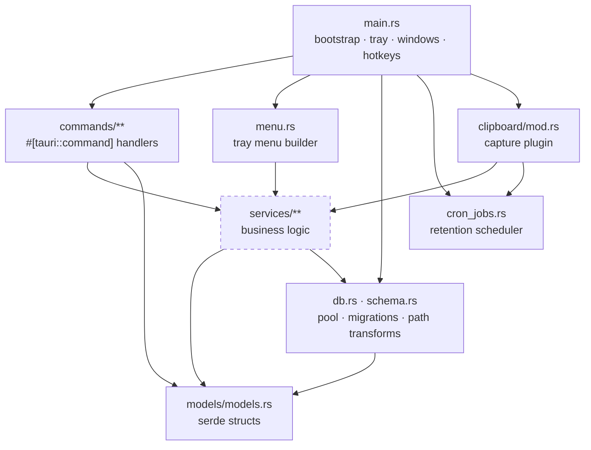
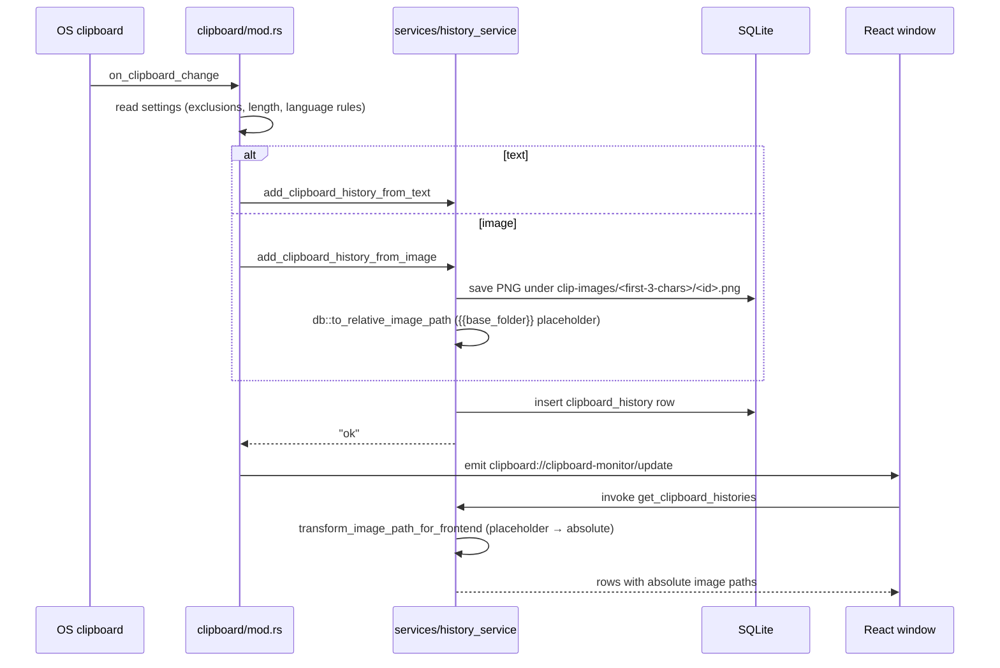

# Architecture

> Last verified: 2026-09-16 · Branch `harnessing` · Refactor status: **pre-Phase-4**
> The module splits described in FIX-PLAN waves W3/W4 have not landed yet, so file-level
> detail below reflects the current (unsplit) layout.

## 1. What the system is

PasteBar is a desktop clipboard manager for macOS and Windows. A Tauri 1.8 shell hosts a
Rust core that watches the system clipboard and a React UI rendered into three separate
webview windows. All data lives in a local SQLite database plus an image directory; there is
no server component in the capture path.

```
┌──────────────────────────────────────────────────────────────────────────┐
│  OS clipboard  ──▶  clipboard-master watcher (Rust, background thread)    │
│                          │                                               │
│                          ▼                                               │
│                    services/history_service  ──▶  SQLite (Diesel)        │
│                          │                              + clip-images/  │
│                          │ emit event                                     │
│                          ▼                                               │
│   ┌───────────────────────────────────────────────────────────────┐      │
│   │ Tauri core (main.rs): tray, hotkeys, windows, global commands │      │
│   └───────────────────────────────────────────────────────────────┘      │
│             ▲ invoke()                              │ emit()             │
│             │                                       ▼                    │
│   ┌───────────────────────────────────────────────────────────────┐      │
│   │ React UI — 3 windows                                          │      │
│   │   main (App.tsx) │ history (history-main.tsx) │ quickpaste     │      │
│   └───────────────────────────────────────────────────────────────┘      │
└──────────────────────────────────────────────────────────────────────────┘
```

## 2. Backend layering

The intended dependency direction is **one-way**:



**Known violations of the intended shape** (tracked as ISSUE-017, to be fixed in W3):

- `main.rs` defines its own `#[tauri::command]` functions (`app_ready`, `autostart`,
  `open_history_window`, `set_icon`, …) rather than delegating to `commands/`.
- `services/utils.rs` reaches sideways into `services/collections_service`.
- `services/history_service.rs` and `services/settings_service.rs` use `crate::db::*`
  directly, which is intended, but nothing prevents a future `services → commands` edge.

**Rules enforced from Phase 3 onward** (see `harness/GOLDEN-RULES.md`):

1. `commands/` parses input and converts errors; it holds no business logic.
2. `services/` holds logic; it never imports from `commands/`.
3. `models/` and `schema.rs` are leaf modules.

## 3. Frontend architecture

Three Vite entries, declared in `packages/pastebar-app-ui/vite.config.mts`:

| Entry                     | Window                   | Root component                            |
| ------------------------- | ------------------------ | ----------------------------------------- |
| `src/main.tsx`            | main window              | `src/App.tsx`                             |
| `src/history-main.tsx`    | clipboard-history window | `src/pages/main/ClipboardHistoryPage.tsx` |
| `src/quickpaste-main.tsx` | QuickPaste popup         | `src/QuickPasteApp.tsx`                   |

State ownership:

| Concern                                          | Mechanism           | Location                                          |
| ------------------------------------------------ | ------------------- | ------------------------------------------------- |
| Server-shaped data (history, items, collections) | React Query         | `hooks/queries/**`                                |
| Atom state                                       | Jotai               | `store/*Store.ts` (`atomWithStore`)               |
| Persisted stores                                 | zustand + `persist` | `store/settingsStore.ts`, `collectionStore.ts`, … |
| Cross-window sync                                | Tauri events        | see §5                                            |

**Vendored code is fenced off.** `src/components/libs/**` contains third-party copies
(react-arborist, react-resizable-panels, react-twitter-embed, boarding-js, simplebar-react)
that are never edited and are excluded from every metric, lint baseline and gate.

**Dead code.** 191 of 428 tracked frontend sources are unreachable from the three entries —
see ISSUE-030. This is pre-existing, not a result of the overhaul, and is scheduled for
deletion in W4a. Until then, any "the type checker is broken" investigation must first
exclude the unreachable set.

## 4. Data flow: a copy becomes a history row



The `{{base_folder}}` round trip is the single most load-bearing convention in the codebase:
image paths are **persisted relative** so the data directory can be relocated, and are made
absolute only at the IPC boundary. Never persist an absolute image path. See
`modules/backend-database.md` §4.

## 5. Multi-window and event flow

| Event                                        | Emitted by                       | Consumed by                              |
| -------------------------------------------- | -------------------------------- | ---------------------------------------- |
| `clipboard://clipboard-monitor/update`       | `clipboard/mod.rs`               | main, history, quickpaste, template view |
| `clips://clips-monitor/update`               | `commands/clipboard_commands.rs` | `App.tsx` only                           |
| `window-events`                              | `main.rs`                        | `App.tsx` (window show/hide/closed)      |
| `setting:update`                             | `main.rs`                        | settings consumers                       |
| `macosx-permissions-modal`                   | `main.rs`                        | `App.tsx`                                |
| `menu:add_first_menu_item`                   | `main.rs` tray                   | `App.tsx`                                |
| `audio-player`                               | frontend                         | frontend (cross-window)                  |
| `settings-store-sync`                        | frontend                         | frontend (cross-window)                  |
| `signal-store-sync`                          | frontend                         | frontend (cross-window)                  |
| `navigate-main`                              | frontend                         | frontend                                 |
| `update-history-items-quickpaste`            | frontend                         | frontend                                 |
| `scheme-request-received`                    | `main.rs`                        | **nothing** (see ISSUE-011)              |
| `execMenuItemById`                           | `main.rs`                        | **nothing**                              |
| `clipboard://clipboard-monitor/update/error` | `clipboard/mod.rs`               | **nothing**                              |

Two windows staying in sync is the reason the frontend emits its own events: a settings
change in the main window must reach the history window and QuickPaste without a reload.
The authoritative, always-regenerated version of this table is
[`contracts/tauri-ipc.md`](contracts/tauri-ipc.md).

## 6. System boundaries

| Boundary            | Where                                                 | Contract                                                                     |
| ------------------- | ----------------------------------------------------- | ---------------------------------------------------------------------------- |
| UI ⇄ Rust           | `invoke()` / events                                   | [`contracts/tauri-ipc.md`](contracts/tauri-ipc.md); drift-gated from Phase 3 |
| Rust ⇄ OS clipboard | `clipboard/mod.rs` via `clipboard-master` + `arboard` | errors degrade to a logged drop                                              |
| Rust ⇄ filesystem   | `db.rs` path helpers only                             | never hard-code a path; data dir is relocatable                              |
| Rust ⇄ network      | `services/request_service.rs`, `reqwest`              | user-initiated requests only                                                 |
| Rust ⇄ shell        | `services/shell_service.rs`                           | see [`security-model.md`](security-model.md)                                 |
| Rust ⇄ secrets      | `commands/security_commands.rs`                       | OS keyring                                                                   |

## 7. Deliberate constraints

- **macOS + Windows only.** Tray and accessibility code is `#[cfg(target_os = …)]`-gated;
  Linux is untested and unsupported.
- **Tauri 1.x is frozen** for this overhaul. A 2.x migration is out of scope.
- **No server.** The `pastebar.app` endpoints are opt-in telemetry/update only.
- **Vendored libraries stay vendored.** Editing them would put them in scope for every gate.
