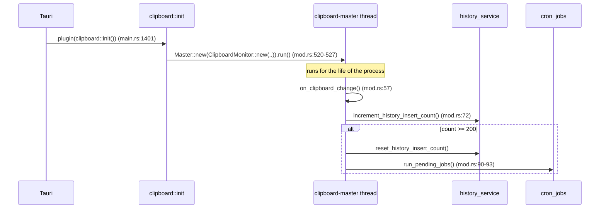

# Backend — clipboard capture

> Last verified: 2026-09-16 · Branch `harnessing` · Refactor status: **pre-Phase-4**

Source: `src-tauri/src/clipboard/mod.rs` (531 lines) and its consumers.

## 1. Responsibility

Own the system clipboard: detect changes, decide whether a change is worth keeping, and hand
the payload to `history_service`. It is the only component that reads the OS clipboard on a
polling basis, and the only place that decides _what to ignore_.

It does **not** own: persistence (that is `history_service`), the retention policy (that is
`cron_jobs`), or paste injection (that is `commands/clipboard_commands.rs`).

## 2. Lifecycle

`clipboard::init()` is registered as a Tauri **plugin**, and plugin `.setup` closures run
before the app-level `.setup` closure. The monitor thread therefore starts before
`db::init(app)` (main.rs:1061) has created the database and run migrations. This is
**ISSUE-002**, a P0: a copy arriving in that window reaches
`establish_pool_db_connection()` → `panic!("Error connecting to db pool")` (db.rs:191-196).
Phase 4 W1 gates the thread start on database readiness.

## 3. The decision pipeline in `on_clipboard_change`

Each step is a settings lookup; the first match short-circuits.

| #   | Gate                   | Setting                                                             | Behaviour when it excludes                                      |
| --- | ---------------------- | ------------------------------------------------------------------- | --------------------------------------------------------------- |
| 1   | History enabled        | `isHistoryEnabled`                                                  | `mod.rs:64-71` — returns early, nothing emitted                 |
| 2   | Text present           | —                                                                   | falls through to the image branch                               |
| 3   | Text trim              | `isHistoryAutoTrimOnCaputureEnabled` (default `true`)               | trims before measuring                                          |
| 4   | Length window          | `clipTextMinLength` (default 0), `clipTextMaxLength` (default 5000) | excluded when shorter than min or longer than max (and max > 0) |
| 5   | Text exclusion list    | `isExclusionListEnabled` + `historyExclusionList`                   | case-insensitive line-contains match                            |
| 6   | App exclusion list     | `isExclusionAppListEnabled` + `historyExclusionAppList`             | case-insensitive exact match on the active window's app name    |
| 7   | Image capture disabled | `isImageCaptureDisabled`                                            | image branch returns early _before_ touching the clipboard      |

Language detection options assembled at `mod.rs:176-214`:
`should_detect_language` (`isHistoryDetectLanguageEnabled`, default true),
`min_lines_required` (`historyDetectLanguageMinLines`, default 3),
`enabled_languages` / `prioritized_languages` (comma-separated lists), and
`auto_mask_words_list` (from `autoMaskWordsList`, lines).

Note that the auto-mask list is collected at capture time but **applied at read time**
(`history_service::process_history_item`), not here. See
[`backend-services.md`](backend-services.md).

## 4. Text vs image branches

**Text** — `history_service::add_clipboard_history_from_text(text, detect_options,
should_auto_star_on_double_copy, copied_from_app)` (mod.rs:214-219).

**Image** — `history_service::add_clipboard_history_from_image(image_binary, …)`
(mod.rs:261-265), guarded by its own app-exclusion check that duplicates the text branch's
logic (mod.rs:238-259). The duplication is one of the W5 extraction targets.

Both return a `String`; only the literal `"ok"` causes an event to be emitted. Any other
return (including the error strings the service can produce) is silently discarded — the
caller cannot distinguish "rejected" from "failed". Tracked as part of ISSUE-011's family of
swallowed signals.

## 5. Events emitted

| Event                                        | Line             | Payload              | Listener                                 |
| -------------------------------------------- | ---------------- | -------------------- | ---------------------------------------- |
| `clipboard://clipboard-monitor/update`       | `mod.rs:285-290` | `"clipboard update"` | main, history, quickpaste, template view |
| `clipboard://clipboard-monitor/update/error` | `mod.rs:296-301` | `error.to_string()`  | **none** — see ISSUE-011                 |

A second, differently-named event `clips://clips-monitor/update` is emitted from
`commands/clipboard_commands.rs:761`. Both names are hand-written string literals with no
shared constant, which is exactly the drift ISSUE-011 records.

## 6. `ClipboardManager`

Thin wrapper over `arboard` (`mod.rs:312-410`):

| Method                | Line         | Behaviour                                                       |
| --------------------- | ------------ | --------------------------------------------------------------- |
| `read_text()`         | `mod.rs:313` | `Clipboard::new().unwrap()` — **panics** if no clipboard handle |
| `write_text(text)`    | `mod.rs:318` | same unwrap-then-map_err shape                                  |
| `write_image(base64)` | `mod.rs:323` | unwraps the handle, then writes image data                      |
| `get_image_binary()`  | `mod.rs:397` | delegates to `get_image_safe()`                                 |
| `read_image_binary()` | `mod.rs:401` | `Clipboard::new().unwrap()` then PNG bytes                      |

The `Clipboard::new().unwrap()` calls are on the hot path (every clipboard change) and are
part of ISSUE-012's W1 scope.

## 7. Known limitations

| Limitation                                                             | Issue          | Detail                                                              |
| ---------------------------------------------------------------------- | -------------- | ------------------------------------------------------------------- |
| Monitor starts before the DB is ready                                  | ISSUE-002 (P0) | plugin setup runs before app setup; panics on a startup-window copy |
| `read_text`/`write_text`/`write_image` unwrap the clipboard handle     | ISSUE-012      | `mod.rs:314,319,324,402`                                            |
| Capture is not truncated, only gated by `clipTextMaxLength`            | ISSUE-023      | a `0` max-length setting stores arbitrary text verbatim             |
| The 200-insert counter is the only thing that ever ticks the scheduler | ISSUE-014      | `run_pending_jobs()` is called nowhere else                         |
| Exclusion-list logic duplicated between text and image branches        | W5             | `mod.rs:141-171` vs `mod.rs:238-259`                                |
| Error event has no listener                                            | ISSUE-011      | clipboard I/O failures are invisible to users                       |
| `println!` used directly                                               | ISSUE-013      | e.g. `mod.rs:65`, `mod.rs:252`                                      |
