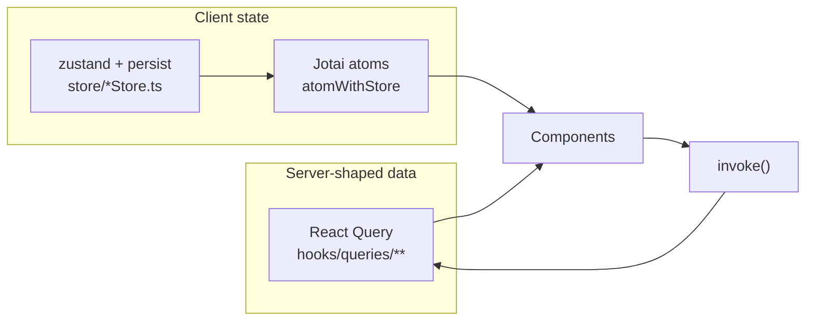

# Frontend — architecture

> Last verified: 2026-09-16 · Branch `harnessing` · Refactor status: **pre-Phase-4**

Source root: `packages/pastebar-app-ui/src` (428 tracked TS/TSX files, 80 895 lines).
`packages/pastebar-app-ui` is the only npm workspace package.

## 1. Three entries, three windows

Declared as Vite `rollupOptions.input` in `packages/pastebar-app-ui/vite.config.mts`:

| Entry HTML              | Entry TS                  | Window            | Root component                            |
| ----------------------- | ------------------------- | ----------------- | ----------------------------------------- |
| `index.html`            | `src/main.tsx`            | main              | `src/App.tsx`                             |
| `history-index.html`    | `src/history-main.tsx`    | clipboard history | `src/pages/main/ClipboardHistoryPage.tsx` |
| `quickpaste-index.html` | `src/quickpaste-main.tsx` | QuickPaste popup  | `src/QuickPasteApp.tsx`                   |

Two further HTML files (`drop-image.html`, `drop-path.html`) are copied as static assets by
`vite-plugin-static-copy`, not compiled as entries.

Each window is a **separate React root in a separate webview**, so nothing is shared in
memory between them. That is the reason cross-window synchronisation is done with Tauri
events rather than with state (§4).

Path alias: `~/*` → `packages/pastebar-app-ui/src/*`, configured in both
`tsconfig.json` (`paths`) and `vite.config.mts` (`resolve.alias`). Keep the two in sync.

## 2. IPC helper layer

Two overlapping wrappers exist:

| Layer           | File                              | Shape                                                                 |
| --------------- | --------------------------------- | --------------------------------------------------------------------- |
| Command helpers | `src/lib/commands.ts`             | `invoke()<T>('command_name')` — a typed **cast**, no runtime check    |
| Query helpers   | `src/hooks/queries/use-invoke.ts` | `invokeFetcher(command, args)` → React Query `useQuery`/`useMutation` |

```ts
// src/lib/commands.ts:1-15
declare global {
  interface Window {
    __TAURI_INVOKE__<T>(cmd: string, args?: Record<string, unknown>): Promise<T>
  }
}
const invoke = () => window.__TAURI_INVOKE__
export function appReady() {
  return invoke()<null>('app_ready')
}
export function appSettings() {
  return invoke()<null>('get_app_settings')
}
```

```ts
// src/hooks/queries/use-invoke.ts:4-13
export const invokeFetcher = async <TArgs, TResult>(command: string, args?: TArgs) => {
  try {
    return invoke(command, args)
  } catch (error) {
    console.error(`invoke command ${command}`, error)
    throw error
  }
}
```

Consequences a contributor must know:

- The `<T>` is an **assertion, not a validation**. A backend shape change produces
  `undefined` deep inside a component instead of an error at the boundary (ISSUE-020).
- `use-invoke.ts` is the one file whose `invoke()` argument is computed rather than a literal,
  so it is the documented exception in the IPC drift gate.
- Only 58 command names are reachable from the frontend; the backend registers 115
  (ISSUE-010). The authoritative pairing is [`../contracts/tauri-ipc.md`](../contracts/tauri-ipc.md).

## 3. State ownership



| Store             | File                                  | Responsibility                                           |
| ----------------- | ------------------------------------- | -------------------------------------------------------- |
| settings          | `store/settingsStore.ts` (1341 lines) | all user settings; emits `settings-store-sync`           |
| clipboard history | `store/clipboardHistoryStore.ts`      | history window state                                     |
| collections       | `store/collectionStore.ts`            | collections, tabs, menu items                            |
| signals           | `store/signalStore.ts`                | small cross-component signals; emits `signal-store-sync` |
| player            | `store/playerStore.ts`                | audio playback; emits `audio-player`                     |
| theme             | `store/themeStore.ts`                 | theme mode/direction, device id                          |
| auth              | `store/authStore.ts`                  | lock/PIN state                                           |
| ui                | `store/uiStore.ts`                    | ephemeral UI state                                       |

`store/index.ts` re-exports all of them, so `import { … } from '~/store'` reaches everything.
New state must use one of these three mechanisms — the project standard is Jotai for atoms,
zustand for persisted stores, React Query for anything that comes from the backend.

## 4. Cross-window synchronisation

Because the windows do not share memory, a change in one is broadcast to the others as an
event, and each window listens and rehydrates its own store:

| Event                             | Emitted from             | Rehydrates                      |
| --------------------------------- | ------------------------ | ------------------------------- |
| `settings-store-sync`             | `store/settingsStore.ts` | settings store in other windows |
| `signal-store-sync`               | `store/signalStore.ts`   | signal store in other windows   |
| `audio-player`                    | `store/playerStore.ts`   | playback state                  |
| `update-history-items-quickpaste` | history window           | QuickPaste list                 |
| `navigate-main`                   | any window               | main window route               |

`App.tsx:496-508` registers the listeners at startup and stores the unlisten handles for
teardown. The complete emitted/listened matrix, generated from the code, is in
[`../contracts/tauri-ipc.md`](../contracts/tauri-ipc.md).

## 5. Component layout

```
src/
├── App.tsx                    main-window root, global listeners (~745 lines)
├── QuickPasteApp.tsx          QuickPaste root
├── pages/
│   ├── main/                  ClipboardHistoryPage (3368), ClipboardHistoryQuickPastePage (1133), PasteMenuPage (877)
│   ├── components/            Dashboard, Menu, ClipboardHistory feature trees
│   └── settings/              UserPreferences (1739), ClipboardHistorySettings (1591), Security, BackupRestore, …
├── layout/                    NavBar (2064), Layout (712), NavBarHistoryWindow (686)
├── components/
│   ├── ui/                    shadcn-style primitives
│   ├── atoms|molecules|organisms/   design-system layers
│   └── libs/                  VENDORED — do not edit
├── hooks/                     feature hooks + hooks/queries/**
├── store/                     state (see §3)
├── locales/                   i18n resources (see ../reference/i18n.md)
└── lib/                       commands.ts, utils.ts, text-transforms.ts, i18n loader
```

**22 files exceed 1000 lines** (ISSUE-018). Wave W4 splits the largest by extracting hooks
and sub-components, with rendering behaviour unchanged.

## 6. Vendored code fences

Never edit, lint, metric or "fix" anything under:

- `src/components/libs/**` — react-arborist, react-resizable-panels, react-twitter-embed,
  boarding-js, simplebar-react and friends.
- `src-tauri/libs/**` (backend side) — the `tao` fork.

They are excluded from `scan.sh`, from the reachability scan, from every lint baseline and
from coverage. Note that the vendored `react-twitter-embed/tests/cypress/**` files account
for 301 of the 408 `tsc` errors in the repository — excluding them is what makes a typecheck
gate possible at all.

## 7. Dead code — read this before investigating any type error

**191 of 428 tracked frontend sources are unreachable from the three entries.** Run
`node scripts/harness/reachability.mjs` for the current list. The bulk is a Medusa-derived
design system (`components/atoms/fundamentals/icons/**`, `components/molecules/select/**`,
`components/search-modal/**`, most of `components/ui/**`) that imports `react-select`,
`react-datepicker` and `moment` — three packages that are **not in any `package.json` and not
installed**. That unresolvable import set is the cause of most project `tsc` errors.

This is ISSUE-030 and it is scheduled for deletion in wave W4a, before the typecheck gate can
be made green. Do not attempt to fix these files; they are scheduled for removal.

## 8. Known limitations

| Limitation                                       | Issue                | Detail                                                 |
| ------------------------------------------------ | -------------------- | ------------------------------------------------------ |
| 191 unreachable source files                     | ISSUE-030 (P1)       | blocks the typecheck gate until deleted                |
| No runtime validation of IPC responses           | ISSUE-020            | `zod` is a dependency but unused at the boundary       |
| No typecheck or lint gate                        | ISSUE-008, ISSUE-007 | nothing runs `tsc` or eslint in CI                     |
| 76 `@ts-ignore`/`@ts-expect-error`/`@ts-nocheck` | ISSUE-008            | unguarded                                              |
| 6 silent `catch {}` sites                        | ISSUE-021            | two inside the data-relocation flow that is already P0 |
| React 19 at root vs React 18 in the package      | ISSUE-022            | hoisting decides what actually bundles                 |
| 22 files over 1000 lines                         | ISSUE-018            | `ClipboardHistoryPage.tsx` is 3368                     |
