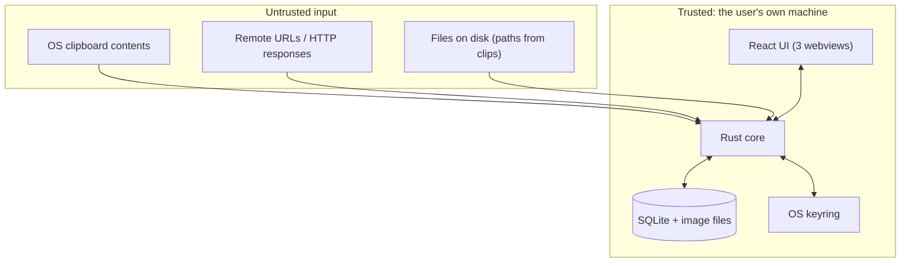

# Security model

> Last verified: 2026-09-16 · Branch `harnessing`

This document records **what PasteBar is allowed to do on the user's behalf, and why**. Its
purpose is to make the difference between an intentional capability and an accidental
backdoor legible to a reviewer or an agent. Anything listed here as _accepted_ is a decision,
not an oversight; anything listed as a _gap_ is tracked in
[`harness/ISSUES.md`](harness/ISSUES.md).

## 1. Trust boundaries



| Boundary                      | Classification             | Control                                            |
| ----------------------------- | -------------------------- | -------------------------------------------------- |
| UI ⇄ Rust                     | Semi-trusted               | Tauri webview; no remote content is loaded into it |
| OS clipboard → Rust           | **Untrusted data**         | treated as text/bytes; never executed              |
| Clips → filesystem operations | **Untrusted data**         | paths are used as given; see §3                    |
| Clips → shell execution       | **Untrusted → privileged** | see §2 — the main risk surface                     |
| Clips → network requests      | **Untrusted data**         | user-initiated only                                |
| Rust → OS keyring             | Privileged                 | `commands/security_commands.rs`                    |

## 2. Shell execution — the one capability that needs a decision

`services/shell_service.rs:30-93` runs an arbitrary command string:

```rust
// windows
Command::new("cmd").current_dir(&current_dir).args(["/C", exec_cmd]).output()
// unix
Command::new("sh").current_dir(&current_dir).arg("-c").arg(exec_cmd).output()
```

- There is **no allowlist** on the command.
- There is **no confirmation prompt** in the Rust layer.
- The working directory is user-configurable (`ExecHomeDir`), defaulting to the home directory.
- The command string originates from a clip's stored value — i.e. from **content the user
  previously copied**, which can come from anywhere.

`src-tauri/tauri.conf.json:16-40` compounds this with a permissive capability set:
`allowlist.all = true`, `shell.open = true`, `protocol.assetScope = ["**"]`,
`path.all = true`, `http.all = true` (scoped by an `http.scope` list that only constrains the
Tauri HTTP API, not `reqwest` used directly in Rust).

**Assessment:** shell-output clips are a legitimate product feature, so this is treated as an
**accepted capability**, not a vulnerability. But it is undocumented, and the _frontend_ is
the only thing standing between a copied string and `sh -c`. That makes it a **P1 review
risk** (ISSUE-016) rather than a P0 code defect.

**Decision (recorded 2026-09-16, see `harness/DECISIONS.md`):** keep the capability, and
require that any future change to it be reviewed against this section. The overhaul does not
change shell behaviour.

**Recommended follow-up (not in this overhaul's scope):** a confirmation prompt for the
first execution of a shell clip, and narrowing `allowlist.all` to the specific APIs actually
used.

## 3. Filesystem

| Operation             | Where                                             | Protection                                                                        |
| --------------------- | ------------------------------------------------- | --------------------------------------------------------------------------------- |
| Write DB, images      | `db.rs` path helpers only                         | paths derive from `get_data_dir()`; relocation is user-driven                     |
| Custom data directory | `commands/user_settings_command.rs`               | `cmd_validate_custom_db_path` rejects `..`, checks directory-ness and writability |
| Read a clip-as-path   | `commands/shell_commands.rs::check_path`          | existence + executable bit check                                                  |
| Delete image files    | `services/utils.rs::delete_file_and_maybe_parent` | **no path confinement** — the stored path is used directly                        |
| Backup/restore        | `commands/backup_restore_commands.rs`             | user-chosen destination                                                           |

**Gap (ISSUE-003, P0):** `cmd_set_and_relocate_data` — the command the UI actually calls to
commit a data-location change — never calls the validator that exists for exactly this
purpose. It goes straight to `fs::create_dir_all` and file moves.

**Gap:** image-file deletion trusts `image_path_full_res` from the database. Because
`to_absolute_image_path` passes through anything that does not carry the
`{{base_folder}}` prefix, a row containing an absolute path outside the data directory would
cause a delete outside the data directory. Reaching that state requires the database to be
modified directly, so it is a defence-in-depth gap rather than an exploit; it is worth
confining deletions to `get_data_dir()` when W1 touches this code.

## 4. Secrets and credentials

| Secret                    | Storage                                                                                                | Notes                                 |
| ------------------------- | ------------------------------------------------------------------------------------------------------ | ------------------------------------- |
| Collection PIN            | hashed, `commands/security_commands.rs::hash_password`                                                 | via `garbados-crypt`                  |
| OS password / lock screen | OS keyring (`store_os_password`, `verify_os_password`, `delete_os_password`, `get_stored_os_password`) | never written to the database         |
| Device id                 | `store/themeStore.ts`                                                                                  | not a secret                          |
| `.env`                    | **was git-tracked**                                                                                    | ISSUE-004 — untracked in Phase 3 §5.5 |

Clipboard content is **not encrypted at rest.** The SQLite database and the image files are
plain files in the user's data directory. This is a deliberate design choice for a local
clipboard manager, but it should be stated in user-facing documentation rather than assumed.

## 5. Network

| Endpoint                                | Purpose                                                      | Trigger                    |
| --------------------------------------- | ------------------------------------------------------------ | -------------------------- |
| `contact.pastebar.app/api/error-report` | error reporting                                              | opt-in                     |
| pastebar.app update endpoints           | update check                                                 | user-initiated or periodic |
| arbitrary URLs                          | link metadata scraping, image/audio fetch, web-request clips | **user-initiated only**    |

`reqwest` calls in `services/request_service.rs` and `commands/link_metadata_commands.rs`
use the URL stored in a clip. There is no SSRF guard, which is acceptable for a local
desktop app whose user is the one supplying the URL, but it means a clip containing
`http://localhost:…` will be fetched. Note that this intersects the shell capability in §2
only if the fetched content is subsequently executed as a shell clip — a path worth
keeping in mind during review.

## 6. Data at rest

| Item              | Location                                        | Sensitive?                                    |
| ----------------- | ----------------------------------------------- | --------------------------------------------- |
| Clipboard history | `<data_dir>/pastebar-db.data`                   | **yes** — contains everything the user copied |
| Captured images   | `<data_dir>/clipboard-images/<3-char>/<id>.png` | **yes**                                       |
| Clip images       | `<data_dir>/clip-images/`                       | **yes**                                       |
| User config       | `<data_dir>/pastebar_settings.yaml`             | path configuration only                       |
| Backups           | user-chosen destination                         | **yes** — a full copy of the above            |

Retention is the user's only control: `isAutoClearSettingsEnabled` plus a duration. **Note
that this control does not reliably run today** — see ISSUE-014 (the scheduler is registered
but never driven by a timer, so age-based auto-clear fires only after 200 clipboard
captures). This is the most consequential security-adjacent bug in the codebase, because it
silently defeats the mechanism a user relies on to limit how long sensitive clipboard content
persists.

## 7. Open items

| Item                                              | Type                      | Issue                     |
| ------------------------------------------------- | ------------------------- | ------------------------- |
| Shell execution capability undocumented           | Review risk               | ISSUE-016                 |
| Relocation path unvalidated                       | P0 gap                    | ISSUE-003                 |
| Retention policy never ticks                      | P1 bug, security-adjacent | ISSUE-014                 |
| `.env` tracked in git                             | P0 hygiene                | ISSUE-004                 |
| Image deletion not confined to the data directory | Defence in depth          | noted in §3               |
| No encryption at rest                             | Accepted design choice    | —                         |
| No SSRF guard on clip URLs                        | Accepted for a local app  | —                         |
| Tauri `allowlist.all = true`                      | Over-broad capability set | recommended follow-up, §2 |
